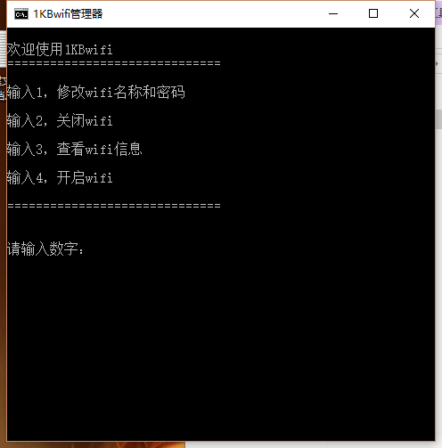

1KBWiFi.bat

自己用bat写的一个开启无线wifi的小玩意，非常小巧，只有1kb，欢迎下载使用 O(∩_∩)O

[右键目标另存为](https://raw.githubusercontent.com/MiQt/XiaoMiWiFi/master/1KBWiFi.bat)

WiFiPassword.bat

可以查看你已经连接过的WiFi的密码

[右键目标另存为](https://raw.githubusercontent.com/MiQt/XiaoMiWiFi/master/WiFiPassword.bat)

